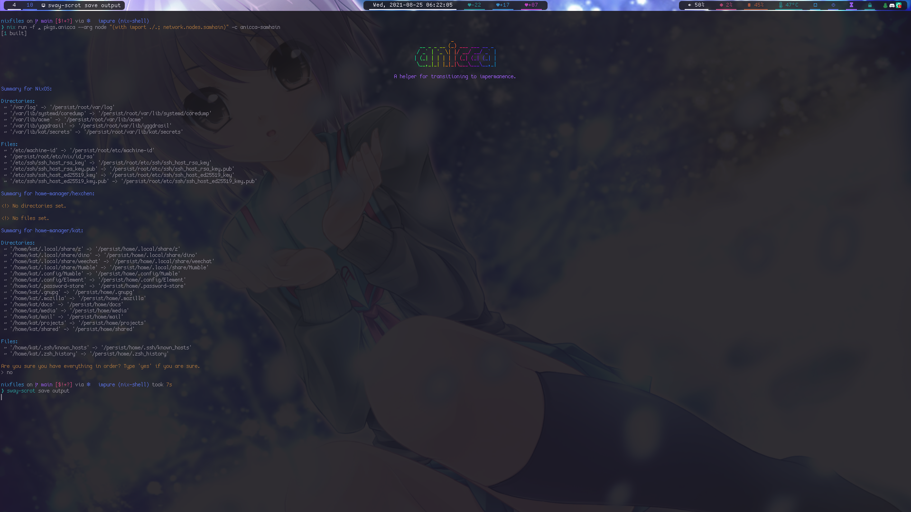

# anicca
A helper for transitioning to impermanence

## Pre-requisites
* The use of the impermanence module for NixOS and home-manager.
* Set up dataset(s) or partition(s) for /persist.

## Screenshot

